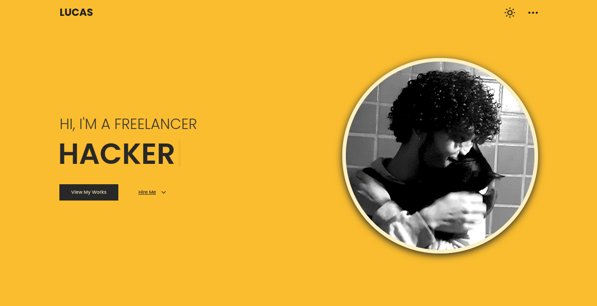

# Portfolio

My portfolio is a modern, responsive, and dynamic web application built using Vue.js. Leveraging Vue's component-based architecture, the site offers a seamless and interactive user experience. The project showcases my skills, projects, and professional journey in a clean and visually appealing manner.

[Visit My Portfolio](https://0x0n0m4d.github.io/portfolio/)



## Project Setup

```sh
yarn
```

### Compile and Hot-Reload for Development

```sh
yarn dev
```

### Type-Check, Compile and Minify for Production

```sh
yarn build
```

## Stack

- [Vue.js](https://vuejs.org/)
